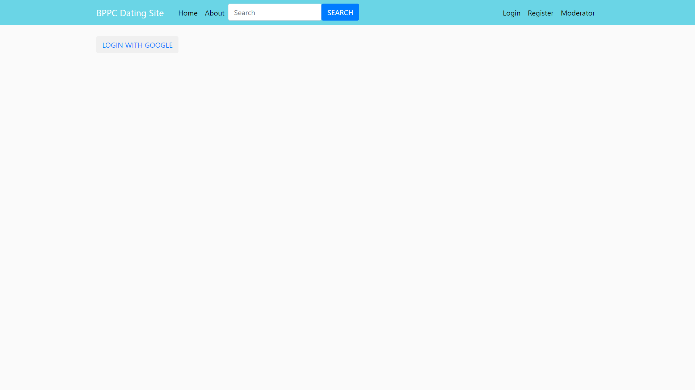
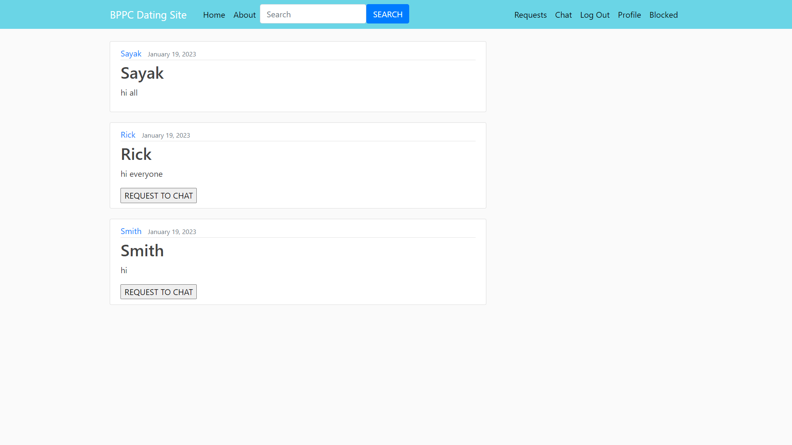
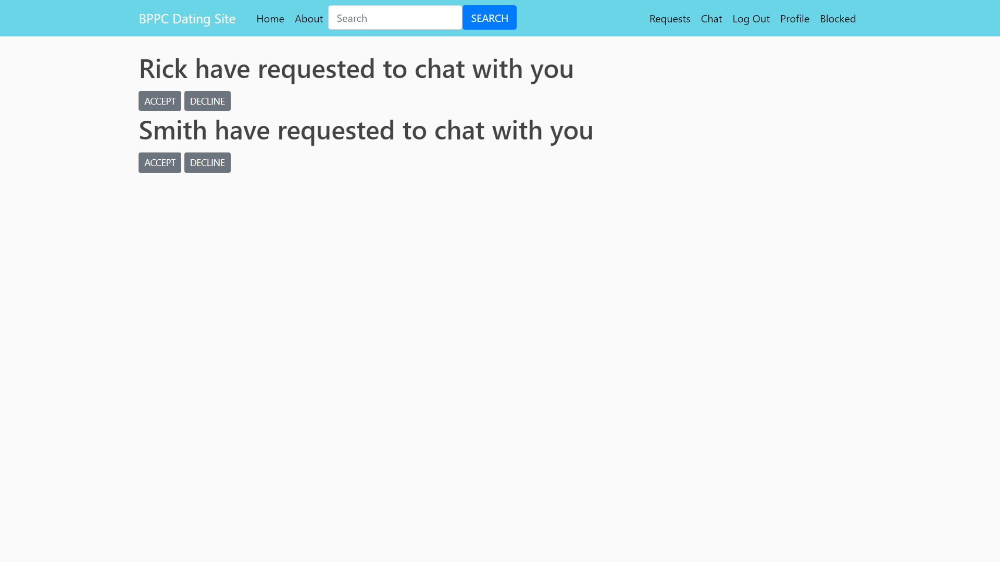
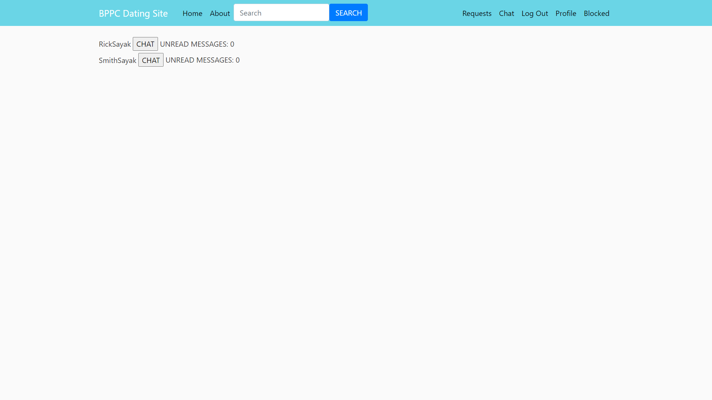
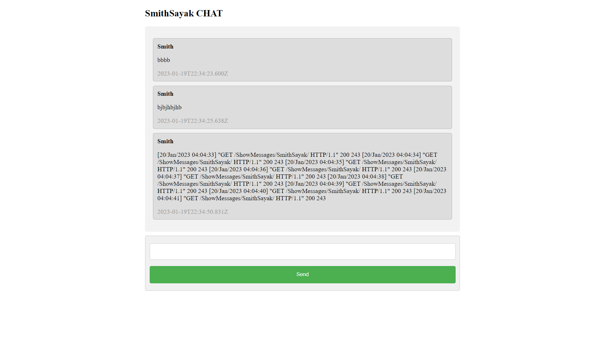

 

  

  <h3 align="center">Dating Website</h3>

## About The Project
Dating Website built using django with one tap google sign-in, real time chat feature, etc.

<h2> Screenshots </h2>

## Built With

Built with the help of django framework.

## Authors

* **Debanna Das** - *Student* - [Debanna Das](https://github.com/dasdebanna) - *dating_website*

